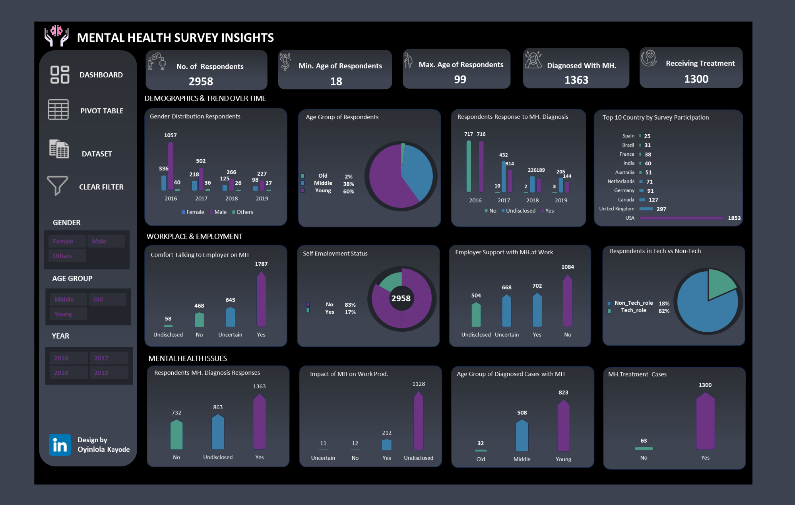

# 🧠 Mental Health Survey Analysis Report

## 📑 Table of Contents
1. [Overview](#1-overview)  
2. [Rationale for the Project](#2-rationale-for-the-project)  
3. [Objectives](#3-objectives)  
4. [Data Description](#4-data-description)  
5. [Tech Stack](#5-tech-stack)  
6. [Project Scope](#6-project-scope)  
7. [Methodology](#7-methodology)  
8. [Project Visualization](#8-project-visualization)  
9. [Results](#9-results)  
10. [Recommendations](#10-recommendations)  
11. [Future Work](#11-future-work)  
12. [Conclusion](#12-conclusion)  

---

## 1. Overview
This project presents a comprehensive analysis of mental health survey data sourced from Kaggle. It explores respondents' experiences, workplace dynamics, diagnosis rates, and treatment status. Insights were communicated through an interactive Excel dashboard leveraging Power Query, PivotTables, DAX, slicers, and VBA scripting. The analysis spans from 2016 to 2019, revealing key mental health patterns across demographics.

---

## 2. Rationale for the Project
Mental health remains an underreported yet essential component of well-being. This analysis uncovers diagnosis patterns, treatment accessibility, and workplace responses—supporting efforts to promote mental health awareness and informed decision-making.

---

## 3. Objectives
- Identify the demographic distribution of respondents  
- Analyze diagnosis and treatment trends over time  
- Explore workplace attitudes toward mental health  
- Understand age-specific diagnosis patterns  
- Deliver actionable insights through interactive dashboards  

---

## 4. Data Description
Three core tables were extracted from Kaggle:

- `Survey Table`: Contains `SurveyID`, Year  
- `Mental Question Table`: Contains mental health questions  
- `Mental Answer Insight Table`: Contains responses to questions  

All tables were extracted using **DB Browser for SQLite** and imported into **PostgreSQL**. Using `SurveyID` and `QuestionID`, joins were performed and `MAX()` aggregation logic was applied to form a **unified insights table**. This dataset was exported to Excel for further analysis.

---

## 5. Tech Stack
- **DB Browser for SQLite**: Initial data extraction  
- **PostgreSQL**: SQL joins, cleaning, transformation using `MAX()` aggregation  
- **Microsoft Excel**: Power Query, PivotTables, DAX measures, and VBA for dashboard interactivity  
- **Design Tools**: Slicers, conditional formatting, visual hierarchy  
- **Publishing**: LinkedIn-ready dashboard visuals  

---

## 6. Project Scope
Focused on survey data from **2016–2019**, this project analyzes:

- Diagnosis and treatment prevalence  
- Employer support and workplace openness  
- Age group and gender-based trends  
- Country-level participation  
- Tech vs. non-tech role distribution  

---

## 7. Methodology

### 🔹 Data Extraction
- Downloaded raw CSVs from Kaggle  
- Previewed tables using DB Browser  
- Imported into PostgreSQL

### 🔹 Data Modeling
- Joined tables using `SurveyID` and `QuestionID`  
- Applied `MAX()` to pivot responses into unified records  

### 🔹 Transformation & Analysis
- Exported unified dataset to Excel  
- Used Power Query for age grouping and job type segmentation  
- Created PivotTables and calculated DAX measures  

### 🔹 Dashboarding
- Built KPI cards, charts, and pie visuals  
- Integrated slicers (gender, year, age group)  
- Used VBA for clear-filter macros and interactivity  

---

## 8. Project Visualization

Key visuals in the dashboard include:
- KPI cards for: Respondents, Diagnosed, Treated, Age Range  
- Bar charts for diagnosis trends (2016–2019)  
- Pie charts for employment types and roles  
- Country-wise participation  
- Age group analysis of diagnosis cases:  
  - Young (60%)  
  - Middle-aged (38%)  
  - Old (2%)  
- Interactive filters and slicers for user exploration

---

## 9. Results

- **Total Respondents**: 2,958  
- **Diagnosed with MH**: 1,363  
- **Receiving Treatment**: 1,300  
- **Gender**: Predominantly male respondents  
- **Top Countries**:  
  - USA: 1,853  
  - UK: 297  
  - Canada: 127  
- **Diagnosis by Age**:  
  - Young: 823  
  - Middle-aged: 508  
  - Old: 32  
- **Age Group Distribution**:  
  - 60% Young  
  - 38% Middle-aged  
  - 2% Old  
- **Employer Support**:  
  - 1,084 responded “No”  
  - 1,787 felt comfortable discussing MH at work  
- **Disclosure Gaps**:  
  - 863 undisclosed diagnosis responses  
  - 1,128 undisclosed productivity impact  
- **Employment Stats**:  
  - 82% in tech-related roles  
  - 83% not self-employed  

---

## 10. Recommendations
- Expand employer-based MH support programs  
- Normalize male emotional expression and well-being  
- Focus outreach efforts on young and tech workforce  
- Build trust in survey tools to reduce disclosure hesitation  
- Leverage insights to shape HR policies and health frameworks  

---

## 11. Future Work
- Extend dataset post-2019 to capture pandemic impact  
- Introduce ML for predictive mental health risk modeling  
- Migrate to Power BI for richer interactivity  
- Benchmark industry-specific mental health metrics  

---

## 12. Conclusion
This project demonstrates full-cycle data analytics: from extraction and SQL modeling in PostgreSQL to interactive Excel dashboards powered by Power Query, DAX, and VBA. It highlights the importance of mental health awareness in workplaces and society and presents clear, actionable data-driven insights.

---

### 👤 Prepared by  
**Oyinlola Kayode**  
*Data Analyst | Dashboard Designer | SQL | Excel | Power BI*
